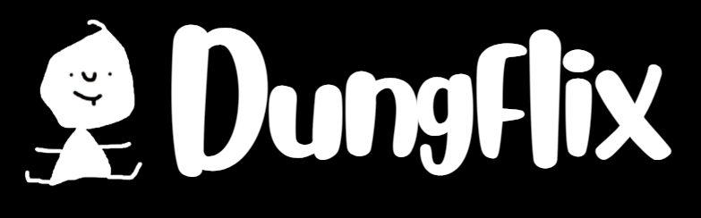

  

# Dungflix

Dungflix is a parody streaming platform built to surpass the UI/UX of every mainstream service.  
No video ads. No malicious links. No dark patterns. No bloated scripts.  
Just a clean, fast, safe, and intentionally ridiculous movie‑browsing experience.

This project is built entirely with HTML and CSS (And the help of Javascript), featuring a custom hand‑drawn mascot (“Dung Baby”) and a smooth, rounded interface inspired by modern streaming layouts.

---

## What is Dungflix?

Dungflix is a lightweight, static “streaming” platform designed to mimic the feel of Netflix, Disney+, and other major services — but without the things that make them annoying:

- No autoplaying trailers  
- No forced ads  
- No pop‑ups  
- No tracking  
- No subscription walls  
- No hidden UI elements  

Instead, Dungflix focuses on:

- **Instant loading**  
- **Simple navigation**  
- **Readable layouts**  
- **A fun, hand‑drawn aesthetic**  
- **A mascot that looks like it crawled out of MS Paint**  

It’s intentionally goofy, intentionally simple, and intentionally better than the real thing.

---

## Features

- **Custom Dungflix logo + mascot**  
- **Rounded header with smooth UI**  
- **Search bar for browsing movies**  
- **“Movie of the Week” highlight**  
- **Individual movie pages** (e.g., `movie1.html`)  
- **Clean folder structure**  
- **No ads, no scripts, no nonsense**  
- **Fully static — works offline**  

---

